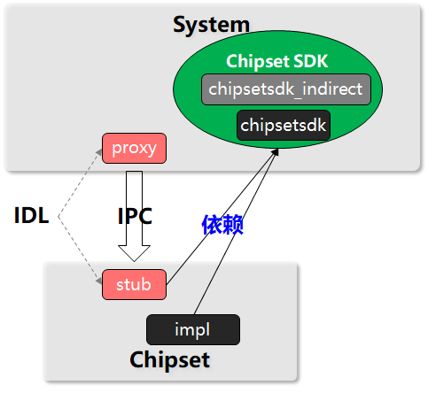

# Chipset SDK白名单规则说明


## 1. Chipset SDK的定义

系统组件模块：安装到system.img中的模块，与芯片和硬件无关。

芯片组件模块：安装到chipset.img中的模块，与芯片或硬件强相关。



如上图所示：Chipset SDK是指允许被芯片组件进程加载的系统组件动态库模块集合。

Chipset SDK集合中的单个模块称之为Chipset SDK模块。Chipset SDK模块分为两类，在BUILD.gn中通过innerapi_tags字段来标识，可选值为：

- chipsetsdk: 芯片组件直接依赖的模块
- chipsetsdk_indirect: chipsetsdk模块间接依赖的模块

在BUILD.gn中的使用样例如下：

```go
ohos_shared_library(sample_chipsetsdk_module) {
    ...
    innerapi_tags = [ "chipsetsdk|chipsetsdk_indirect" ]
    ...
}
```

chipsetsdk和chipsetsdk_indirect类型的模块都需要被芯片组件进程加载，这两个类型的模块都会安装到/chipset/lib{64}/chipset-sdk或/chipset/lib{64}/chipset-pub-sdk目录下，都可以被芯片组件沙盒访问。

相比较于/chipset/lib{64}/chipset-sdk目录，/chipset/lib{64}/chipset-pub-sdk目录下的模块既能被芯片组件沙盒访问，也能被应用进程沙盒访问。

## 2. 规则解释

Chipset SDK白名单规则有几个方面的含义：

### 2.1 芯片组件模块编译时能且仅能依赖系统组件中的chipsetsdk类型的ChipsetSDK模块

违反此规则时，编译过程会产生如下格式的NOT ALLOWED错误：

```
[NOT ALLOWED]: chipset module libNNN.z.so depends on non Chipset SDK module libsystemMMM.z.so in //NNNpath:libNNN
```

该错误的含义是：芯片组件的libNNN.z.so模块依赖了libsystemMMM.z.so，而libsystemMMM.z.so并不是Chipset SDK的模块。

处理方法：

1）检查libNNN.z.so是否需要安装到芯片组件中？如果是系统组件的产物，就不受此规则约束。一般是在BUILD.gn中的install_images字段决定安装到哪个组件中。

2）如果libNNN.z.so确实需要安装到芯片组件中，则分析对libsystemMMM.z.so的依赖是否是必须的。经常会出现libNNN.z.so是一个巨型库，对libsystemMMM.z.so的依赖部分并不会被芯片组件实际使用，此时可以考虑把libNNN.z.so进行拆分，把芯片组件确实需要使用的部分保留在芯片组件中；不需要的部分放在系统组件其它的库里。

3）如果以上都不满足，需要联系libsystemMMM.z.so的提供者，把此模块整改为Chipset SDK模块。参考第3章Chipset SDK模块基本要求。

### 2.2 Chipset SDK模块能且仅能依赖其它的Chipset SDK模块

违反此规则时，编译过程会产生如下格式的NOT ALLOWED错误：

```
[NOT ALLOWED]: Chipset SDK module libNNN.z.so depends on non Chipset SDK module libsystemMMM.z.so in //NNNpath:libNNN
```

该错误的含义是：系统组件中的libNNN.z.so模块是Chipset SDK模块，其依赖的libsystemMMM.z.so并不是Chipset SDK模块。

处理方法：

1）分析新增对libsystemMMM.z.so的依赖是否合理。

2）如果以上都不满足，可以有两种处理方法：

a）为libsystemMMM.z.so增加chipsetsdk_indirect类型的innerapi_tags，表示此模块为间接依赖模块。

b）联系libsystemMMM.z.so的提供者，把此模块整改为Chipset SDK模块，增加chipsetsdk类型的innerapi_tags。参考第3章Chipset SDK模块基本要求。

### 2.3 Chipset SDK模块白名单管理

- Chipset SDK模块没有标记类型

  每个Chipset SDK模块都需要在innerapi_tags中加上chipsetsdk或chipsetsdk_indirect标记；否则会报以下类型的错误：

  ```shell
  [ERROR]: Chipset SDK module libxxx.so has no innerapi_tags with "chipsetsdk", add it in //base/startup/init/interfaces/innerkits/init_module_engine:libinit_stub_empty
  ```

  处理方法：按照提示在对应的BUILD.gn中添加innerapi_tags标记。

- 非Chipset SDK模块添加了Chipset SDK模块标记

  非Chipset SDK模块不要添加chipsetsdk或chipsetsdk_indirect标记；否则会报以下类型的错误：

  ```shell
  [ERROR]: non chipsetsdk_indirect module libdfx_dumpcatcher.z.so with innerapi_tags="chipsetsdk_indirect", //base/hiviewdfx/faultloggerd/interfaces/innerkits/dump_catcher:libdfx_dumpcatcher
  ```

  处理方法：按照提示在对应的BUILD.gn中去掉innerapi_tags中的标记。


## 3. Chipset SDK模块基本要求

### 3.1 Chipset SDK模块所属部件必须加入最小系统部件集

为了支持芯片组件独立编译，每个Chipset SDK模块所属的部件必须是[最小系统部件集合](https://gitee.com/openharmony/productdefine_common/base/standard_system.json)中的部件，确保最小系统可以正常编译；防止芯片组件编译时需要引入其他过多的系统组件部件。

---

三方库模块不需要加入最小系统部件集合。

----

### 3.2 Chipset SDK模块对外API需稳定

Chipset SDK模块提供了跨组件的接口，需要维护稳定的对外API。基本要求如下：

1）对外头文件需要在所属部件bundle.json中标注

2）对外头文件需要清晰的文档注释

3）对外API变更时需要向前兼容

### 3.3 Chipset SDK模块需加入到白名单列表

chipsetsdk_indirect类型的Chipset SDK模块需加入到[chipsetsdk_indirect.json](chipsetsdk_indirect.json)文件中

~~chipsetsdk类型的Chipset SDK模块需加入到[whitelist.json](whitelist.json)文件中，同时需要更新模块描述信息文件[chipsetsdk_info.json](chipsetsdk_info.json)。~~

**chipsetsdk类型的Chipset SDK模块需加入到[chipsetsdk_info.json](chipsetsdk_info.json)文件中(原whistlist.json文件中原so信息已变更格式后迁移到  chipsetsdk_info.json文件中 ，后续请更新chipsetsdk_info.json文件，不再使用whitelist.json文件)**

**白名单json格式变更如下**

变更前：
```
[
  "libc.so",
  "so名称"
]
```
变更后：
```
[
  {
        "name": "hilog:libhilog",
        "so_file_name": "libhilog.so",
        "path": "//base/hiviewdfx/hilog/interfaces/native/innerkits:libhilog",
        "headers": [
            "//base/hiviewdfx/hilog/interfaces/native/innerkits/include/"
        ]
    },
  {
        "name": "归属部件:模块名",
        "so_file_name": "so名称",
        "path": "编译路径",
        "headers": []
    }
]
```
----