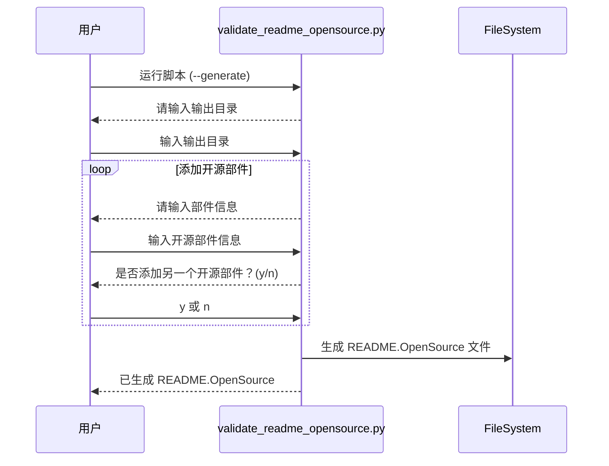
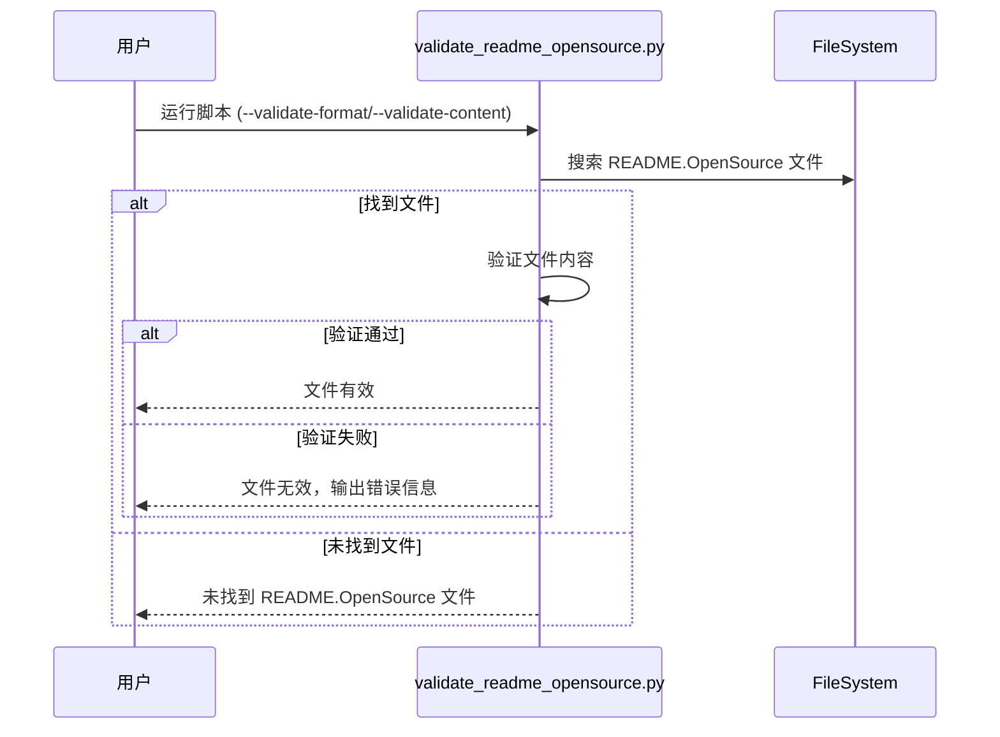

# 开源软件 `README.OpenSource` 工具使用文档

## 目录

- 开源软件 `README.OpenSource` 工具使用文档
  - 简介
  - 功能概述
  - 安装与环境配置
    - 环境要求
    - 安装步骤
  - 使用指南
    - 生成 `README.OpenSource` 文件
    - 验证 `README.OpenSource` 文件
      - 验证格式
      - 验证内容
    - 命令行参数
  - 测试与验证
    - 自动化测试
      - 运行测试
      - 预期结果
    - 手动测试
  - 目录结构
  - 工作流程概览
    - 生成工具流程图
    - 验证工具流程图

## 简介

本工具旨在为项目中的每个开源部件创建标准化的 `README.OpenSource` 文件，并提供验证这些文件格式和内容的功能。该工具仅使用 Python 标准库开发，易于安装和使用。通过合并生成和验证功能，用户可以使用单个脚本完成所有操作，并根据需要选择不同的功能场景。

## 功能概述

- 生成工具 ：
  - 通过交互方式，用户输入开源部件的信息，支持多个部件的输入。
  - 生成符合规范的 `README.OpenSource` 文件，包含所有输入的部件信息。

- 验证工具：
  - **格式验证**：验证项目中所有 `README.OpenSource` 文件的格式，检查必需字段是否完整，JSON 格式是否正确。
  - **内容验证**：对 `README.OpenSource` 文件中的特定字段，如 `"Name"`、`"License"`、`"Version Number"`、`"Upstream URL"`，与参考数据进行比对，确保其内容符合预期。还会验证 `"License File"` 字段指向的文件是否存在，路径应相对于 `README.OpenSource` 文件所在目录。

## 安装与环境配置

### 环境要求

- **Python 版本**：Python 3.6 或更高版本
- **操作系统**：跨平台，支持 Linux/Windows

### 安装步骤

1. **克隆或下载项目代码**

   ```
   git clone https://gitee.com/openharmony/developtools_integration_verification.git
   cd tools/opensource_tools
   ```

2. **（可选）创建虚拟环境**

   ```
   python -m venv venv
   source venv/bin/activate  # Linux/macOS
   # 或
   venv\Scripts\activate     # Windows
   ```

3. **安装依赖**

   由于该工具仅使用 Python 标准库，无需安装额外依赖。

## 使用指南

### 生成 `README.OpenSource` 文件

运行 `generate_readme_opensource.py` 脚本，按照提示输入开源部件的信息。

**步骤：**

1. **进入项目目录**

   ```
   cd src
   ```

2. **运行生成脚本**

   ```
   python generate_readme_opensource.py
   ```

3. **按照提示输入信息**

   - 脚本将提示您输入输出目录，默认为当前目录。
   - 输入每个部件的详细信息，包括：
     - Name
     - License
     - License File
     - Version Number
     - Owner
     - Upstream URL
     - Description
   - 输入完成后，选择是否添加另一个部件。

4. **完成生成**

   - 脚本将在指定的输出目录下生成 `README.OpenSource` 文件。

**示例：**

```
python generate_readme_opensource.py

请输入输出目录（默认当前目录）：
Name: elfutils
License: LGPL-2.1, LGPL-3.0, GPL-2.0
License File: COPYING-GPLV2
Version Number: 0.188
Owner: opensource@sourceware.org
Upstream URL: https://sourceware.org/elfutils/
Description: A collection of tools and libraries.
是否添加另一个部件？(y/n): y
Name: OpenSSL
License: Apache-2.0
License File: LICENSE
Version Number: 1.1.1
Owner: opensource@openssl.org
Upstream URL: https://www.openssl.org/
Description: A toolkit for TLS and SSL protocols.
是否添加另一个部件？(y/n): n
已生成 ./README.OpenSource
```

### 验证 `README.OpenSource` 文件

运行 `validate_readme_opensource.py` 脚本，使用不同的参数进行格式或内容验证。

#### 验证格式

验证项目中所有 `README.OpenSource` 文件的格式和必需字段。

**步骤：**

1. **进入项目目录**

   ```
   cd src
   ```

2. **运行格式验证脚本**

   ```
   python validate_readme_opensource.py --validate-format [目录路径]
   ```

   - 如果不指定目录路径，默认验证当前目录。

3. **查看验证结果**

   - 脚本将输出验证结果，指示文件是否有效。
   - 如果有错误，脚本会列出具体的错误信息。

**示例：**

```
python validate_readme_opensource.py --validate-format .

./README.OpenSource format is valid.
```

#### 验证内容

对 `README.OpenSource` 文件中的特定字段与参考数据进行比对。

**步骤：**

1. **准备参考数据**

   创建一个包含参考数据的 JSON 文件，例如 `reference_data.json`，内容如下：

   ```
   [
     {
       "Name": "elfutils",
       "License": "LGPL-2.1, LGPL-3.0, GPL-2.0",
       "Version Number": "0.188",
       "Upstream URL": "https://sourceware.org/elfutils/"
     },
     {
       "Name": "OpenSSL",
       "License": "Apache-2.0",
       "Version Number": "1.1.1",
       "Upstream URL": "https://www.openssl.org/"
     }
   ]
   ```

2. **运行内容验证脚本**

   ```
   python validate_readme_opensource.py --validate-content --reference-data reference_data.json [目录路径]
   ```

3. **查看验证结果**

   - 脚本将输出验证结果，指示文件是否有效。
   - 如果有错误，脚本会列出具体的错误信息。

**示例：**

```
python validate_readme_opensource.py --validate-content --reference-data reference_data.json .

Validating: ./README.OpenSource
./README.OpenSource: Content validation passed.
Validation process completed.
```

### 命令行参数

- `--validate-format`：验证 `README.OpenSource` 文件的格式和必需字段。
- `--validate-content`：验证 `README.OpenSource` 文件的内容，与参考数据比对。
- `--reference-data`：指定参考数据的 JSON 文件路径（内容验证时必需）。
- `--log-file`：指定日志文件路径，保存验证结果。

**注意**：`--validate-format` 和 `--validate-content` 可以组合使用，顺序执行格式和内容验证。

## 测试与验证

### 自动化测试

项目包含自动化测试用例，确保工具的可靠性。

#### 运行测试

1. **进入项目根目录**

   ```
   cd opensource_tools
   ```

2. **运行所有测试用例**

   ```
   python -m unittest discover -s test
   ```

#### 预期结果

```
..
----------------------------------------------------------------------
Ran 3 tests in 0.001s

OK
```

### 手动测试

#### 生成工具测试

- **测试正常输入**：按照使用指南运行生成脚本，输入多个部件的信息，检查生成的 `README.OpenSource` 文件内容是否正确。
- **测试边界情况**：输入空值、特殊字符、超长字符串，观察脚本是否能正常处理。

#### 验证工具测试

- **验证正确的文件**：使用生成的正确的 `README.OpenSource` 文件，运行验证脚本，确保验证通过。
- **验证错误的文件**：手动修改 `README.OpenSource` 文件，引入格式错误或缺少字段，运行验证脚本，检查是否能正确捕获错误。
- **验证内容不匹配**：修改 `README.OpenSource` 文件的字段，使其与参考数据不一致，运行内容验证，检查是否能正确报告不匹配项。

## 目录结构

以下是项目的目录结构：

- **src/**
  - `generate_readme_opensource.py`：生成README.OpenSource开源不见配置信息脚本
  - `validate_readme_opensource.py`：验证工具脚本，包含JSON格式验证和内容验证功能。

- **test/**
  - `test_generate_readme_opensource.py`：生成工具测试用例
  - `test_validate_readme_opensource.py`：工具的测试用例。
- **README_OSS.md**：使用文档（本文件）。

## 工作流程概览

### 生成工具流程图



### 验证工具流程图


