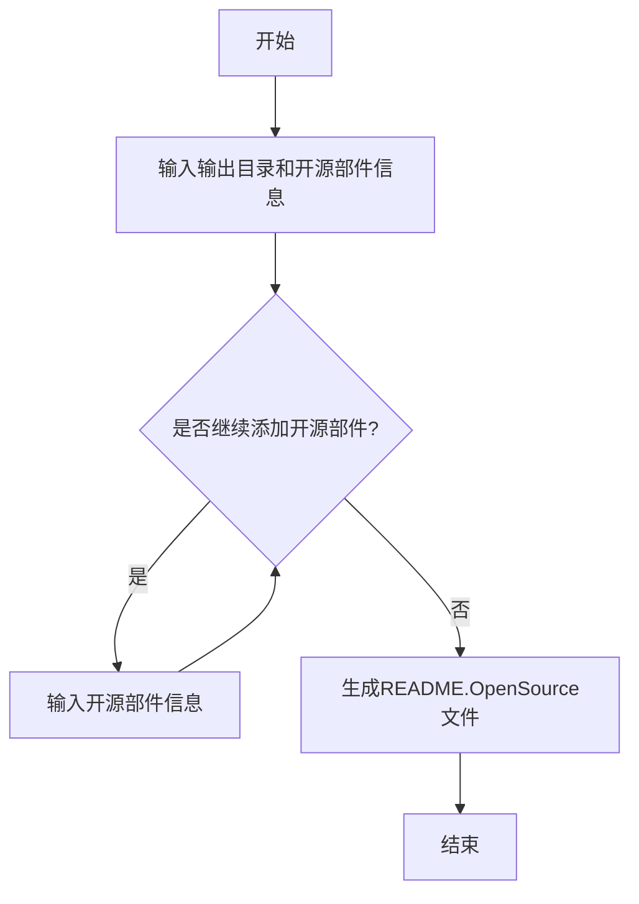
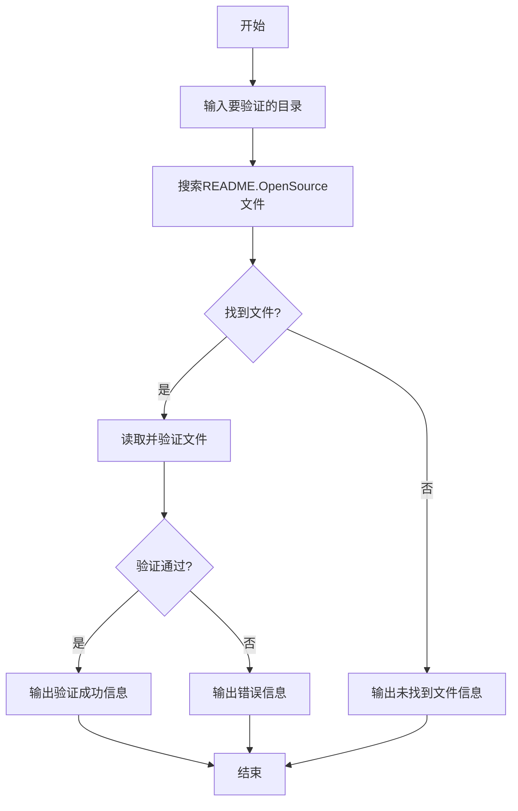
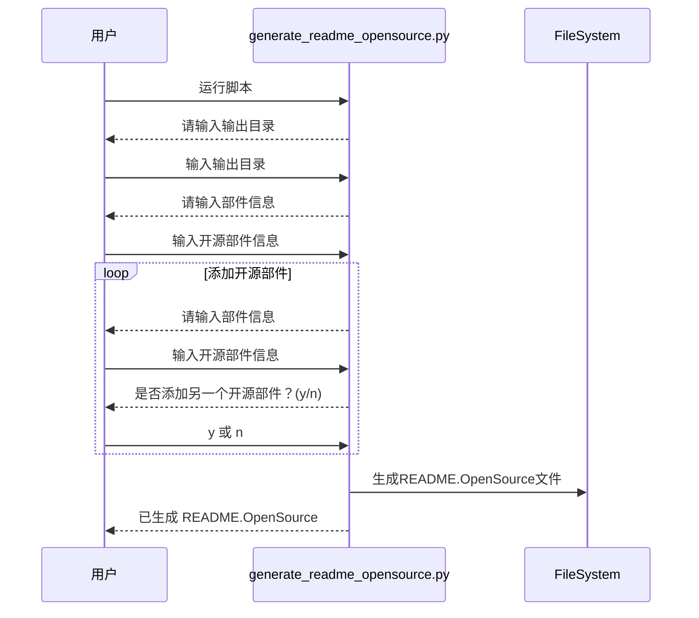
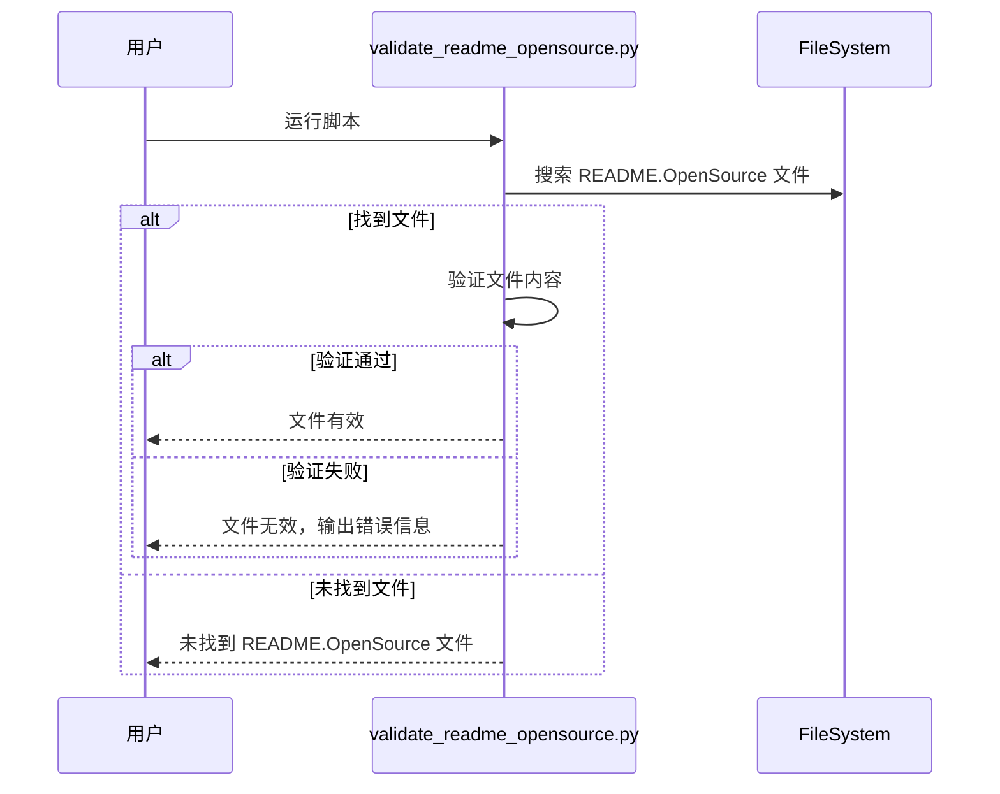

# 开源软件README.OpenSource工具使用文档

## 目录

- [开源软件README.OpenSource工具使用文档](#开源软件readmeopensource工具使用文档)
  - [目录](#目录)
  - [简介](#简介)
  - [功能概述](#功能概述)
    - [工作流程概览](#工作流程概览)
      - [生成工具工作流程](#生成工具工作流程)
      - [验证工具工作流程](#验证工具工作流程)
  - [安装与环境配置](#安装与环境配置)
    - [环境要求](#环境要求)
    - [安装步骤](#安装步骤)
  - [使用指南](#使用指南)
    - [生成 `README.OpenSource` 文件](#生成-readmeopensource-文件)
      - [步骤](#步骤)
      - [示例](#示例)
      - [生成工具流程图](#生成工具流程图)
    - [验证 `README.OpenSource` 文件](#验证-readmeopensource-文件)
      - [步骤](#步骤-1)
      - [示例](#示例-1)
      - [验证工具流程图](#验证工具流程图)
      - [处理验证错误](#处理验证错误)
  - [测试与验证](#测试与验证)
    - [自动化测试](#自动化测试)
      - [运行测试](#运行测试)
      - [预期结果](#预期结果)
    - [手动测试](#手动测试)
      - [生成工具测试](#生成工具测试)
      - [验证工具测试](#验证工具测试)
  - [目录结构](#目录结构)

## 简介

本开源软件工具旨在为项目中的每个开源组件创建标准化的 `README.OpenSource` 文件，并提供验证这些文件格式和内容的功能。该工具仅使用 Python 标准库开发，易于安装和使用。

## 功能概述

- **生成工具**：`generate_readme_opensource.py`
  - 通过交互方式，用户输入开源组件的信息，支持多个组件的输入。
  - 生成符合规范的 `README.OpenSource` 文件，包含所有输入的组件信息。
- **验证工具**：`validate_readme_opensource.py`
  - 验证项目中所有 `README.OpenSource` 文件的格式和内容。
  - 检查必需字段是否完整，JSON 格式是否正确。

### 工作流程概览

下面是对应的工具的工作流程示意图

#### 生成工具工作流程



#### 验证工具工作流程




## 安装与环境配置

### 环境要求

- **Python 版本**：Python 3.6 或更高版本
- **操作系统**：跨平台，支持 Linux/Windows

### 安装步骤

1. **克隆或下载项目代码**

   ```
   git clone https://gitee.com/openharmony/developtools_integration_verification.git
   cd tools/opensource_tools
   ```

2. **（可选）创建虚拟环境**

   ```
   python -m venv venv
   source venv/bin/activate  # Linux/macOS
   # 或
   venv\Scripts\activate     # Windows
   ```

3. **安装依赖**

   由于该工具仅使用 Python 标准库，无需安装额外依赖。

## 使用指南

### 生成 `README.OpenSource` 文件

运行 `generate_readme_opensource.py` 脚本，按照提示输入开源组件的信息。

#### 步骤

1. **进入项目目录**

   ```
   cd src
   ```

2. **运行生成脚本**

   ```
   python generate_readme_opensource.py
   ```

3. **按照提示输入信息**

   - 脚本将提示您输入输出目录，默认为当前目录。
   - 输入每个组件的详细信息，包括：
     - Name
     - License
     - License File
     - Version Number
     - Owner
     - Upstream URL
     - Description
   - 输入完成后，选择是否添加另一个组件。

4. **完成生成**

   - 脚本将在指定的输出目录下生成 `README.OpenSource` 文件。

#### 示例

```
请输入输出目录（默认当前目录）：
Name: elfutils
License: LGPL-2.1, LGPL-3.0, GPL-2.0
License File: COPYING-GPLV2
Version Number: 0.188
Owner: opensource@sourceware.org
Upstream URL: https://sourceware.org/elfutils/
Description: A collection of tools and libraries.
是否添加另一个组件？(y/n): y
Name: OpenSSL
License: Apache-2.0
License File: LICENSE
Version Number: 1.1.1
Owner: opensource@openssl.org
Upstream URL: https://www.openssl.org/
Description: A toolkit for TLS and SSL protocols.
是否添加另一个组件？(y/n): n
已生成 ./README.OpenSource
```

#### 生成工具流程图




### 验证 `README.OpenSource` 文件

运行 `validate_readme_opensource.py` 脚本，验证指定目录中的 `README.OpenSource` 文件。

#### 步骤

1. **进入项目目录**

   ```
   cd src
   ```

2. **运行验证脚本**

   ```
   python validate_readme_opensource.py [目录路径]
   ```

   - 如果不指定目录路径，默认验证当前目录。

3. **查看验证结果**

   - 脚本将输出验证结果，指示文件是否有效。
   - 如果有错误，脚本会列出具体的错误信息。

#### 示例

```
python validate_readme_opensource.py .

./README.OpenSource is valid.
```

#### 验证工具流程图




#### 处理验证错误

如果验证失败，脚本会输出类似以下的错误信息：

```
./README.OpenSource is invalid:
  - Component 1 is missing required field: License
  - JSON decode error: Expecting value: line 10 column 5 (char 250)
```

请根据提示修复 `README.OpenSource` 文件中的错误，然后重新运行验证脚本。

## 测试与验证

### 自动化测试

项目包含自动化测试用例，确保工具的可靠性。

#### 运行测试

1. **进入项目根目录**

   ```
   cd opensource_tools
   ```

2. **运行所有测试用例**

   ```
   python -m unittest discover -s test
   ```

#### 预期结果

```
..
----------------------------------------------------------------------
Ran 3 tests in 0.001s

OK
```

### 手动测试

#### 生成工具测试

- **测试正常输入**：按照使用指南运行生成脚本，输入多个组件的信息，检查生成的 `README.OpenSource` 文件内容是否正确。
- **测试边界情况**：输入空值、特殊字符、超长字符串，观察脚本是否能正常处理。

#### 验证工具测试

- **验证正确的文件**：使用生成的正确的 `README.OpenSource` 文件，运行验证脚本，确保验证通过。
- **验证错误的文件**：手动修改 `README.OpenSource` 文件，引入格式错误或缺少字段，运行验证脚本，检查是否能正确捕获错误。

## 目录结构

以下是项目的目录结构：

- src/  

  - `generate_readme_opensource.py`：生成工具脚本
  - `validate_readme_opensource.py`：验证工具脚本

- test/
  - `test_generate_readme_opensource.py`：生成工具测试用例
  - `test_validate_readme_opensource.py`：验证工具测试用例

- **README_OSS.md**：使用文档

