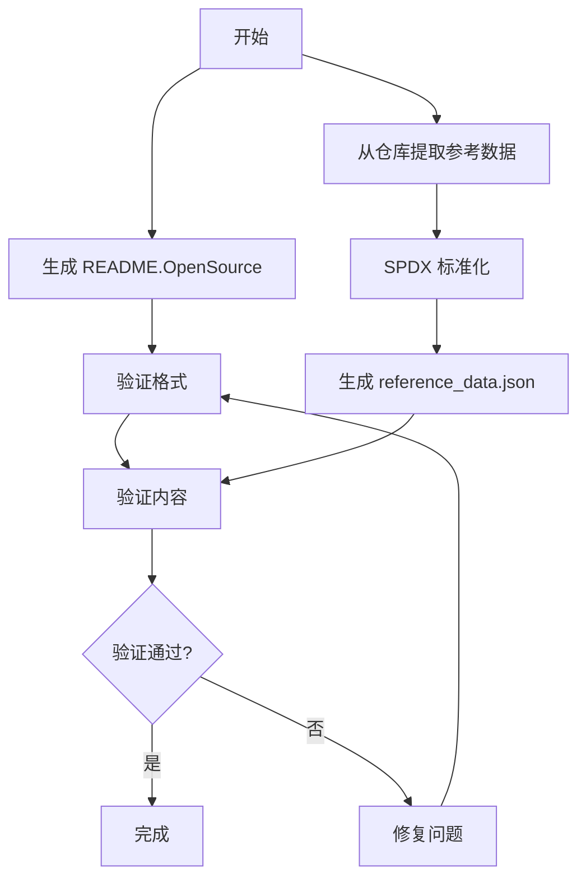

# 开源软件 `README.OpenSource` 工具使用文档

## 目录

- [简介](#简介)
- [功能概述](#功能概述)
- [安装与环境配置](#安装与环境配置)
  - [环境要求](#环境要求)
  - [安装步骤](#安装步骤)
- [使用指南](#使用指南)
  - [生成 README.OpenSource 文件](#生成-readmeopensource-文件)
  - [验证 README.OpenSource 文件](#验证-readmeopensource-文件)
  - [生成参考数据](#生成参考数据)
  - [SPDX 许可证标准化](#spdx-许可证标准化)
  - [Excel 批量许可证匹配](#excel-批量许可证匹配)
- [目录结构](#目录结构)
- [工作流程概览](#工作流程概览)
- [SPDX 许可证支持](#spdx-许可证支持)

## 简介

本工具旨在为项目中的每个开源部件创建标准化的 `README.OpenSource` 文件，并提供验证这些文件格式和内容的功能。工具支持 SPDX 许可证标准化，确保许可证标识符符合国际规范。

## 功能概述

### 生成工具
- 通过交互方式或命令行参数输入开源部件信息
- 支持多个部件的批量输入
- 支持多种许可证配置方式（一对一、一对多、多对一）
- 自动将许可证名称转换为 SPDX 标准标识符
- 生成符合规范的 `README.OpenSource` 文件

### 验证工具
- **格式验证**：验证 JSON 格式、必需字段、依赖项格式
- **内容验证**：与参考数据比对、许可证文件存在性检查
- **SPDX 验证**：验证许可证标识符是否符合 SPDX 标准

### 参考数据生成
- 从 OpenHarmony 仓库的 README.OpenSource 文件提取参考数据
- 自动转换为 SPDX 标准许可证标识符
- 支持去重和自定义输出路径

### SPDX 许可证转换
- 将各种许可证名称格式转换为 SPDX 标准标识符
- 支持 WITH exception 格式（如 `Apache-2.0 WITH LLVM-exception`）
- 支持多种分隔符（;、/、,、or、OR）
- 内置 712+ 个 SPDX 许可证映射

## 安装与环境配置

### 环境要求

- **Python 版本**：Python 3.8 或更高版本
- **操作系统**：跨平台，支持 Linux/Windows

### 安装步骤

1. **克隆或下载项目代码**

   ```bash
   git clone https://gitee.com/openharmony/developtools_integration_verification.git
   cd tools/opensource_tools
   ```

2. **（可选）创建虚拟环境**

   ```bash
   python -m venv venv
   source venv/bin/activate  # Linux/macOS
   # 或
   venv\Scripts\activate     # Windows
   ```

3. **安装依赖**

   ```bash
   pip install -r requirements.txt
   ```

   **依赖列表：**
   - `pandas>=1.3.0` - Excel 处理
   - `openpyxl>=3.0.0` - Excel 文件支持
   - `pytest>=6.0.0` - 单元测试

## 使用指南

### 生成 README.OpenSource 文件

#### 交互式生成

运行 `generate_readme_opensource.py` 脚本，按照提示输入开源部件的信息。

```bash
cd src
python generate_readme_opensource.py
```

**步骤：**
1. 输入输出目录（默认为当前目录）
2. 依次输入每个部件的详细信息：
   - Name：组件名称
   - License：许可证（自动转换为 SPDX 标准，多个用分号分隔）
   - License File：许可证文件路径（多个用分号分隔）
   - Version Number：版本号
   - Owner：维护者
   - Upstream URL：上游地址
   - Description：描述信息
   - Dependencies（可选）：依赖项（多个用逗号分隔）
3. 选择是否添加另一个部件

### 验证 README.OpenSource 文件

#### 验证格式

验证项目中所有 `README.OpenSource` 文件的格式和必需字段。

```bash
python validate_readme_opensource.py --validate-format [目录路径]
```

**验证检查内容：**
- JSON 格式的正确性
- 必需字段的完整性
- Dependencies 字段（若存在）的数组格式

#### 验证内容

验证 `README.OpenSource` 文件内容与参考数据的一致性。

```bash
python validate_readme_opensource.py --validate-content --reference-data reference_data.json [目录路径]
```

**验证内容包括：**
- 核心字段（Name、License、Version Number、Upstream URL）与参考数据的一致性
- License File 文件实际存在性检查
- Dependencies 字段（若存在）的有效性检查
- License 字段的 SPDX 标识符有效性检查

#### 命令行参数

| 参数 | 说明 |
|------|------|
| `project_root` | 项目根目录路径 |
| `--validate-format` | 执行格式验证 |
| `--validate-content` | 执行内容验证 |
| `--reference-data` | 参考数据 JSON 文件路径（内容验证必需） |
| `--log-file` | 日志文件路径 |

### 生成参考数据

从 OpenHarmony 仓库的 README.OpenSource 文件提取参考数据并生成 `reference_data.json`。

```bash
python generate_reference_data.py [选项]
```

**选项：**
| 参数 | 默认值 | 说明 |
|------|--------|------|
| `--ohos-root` | `/home/jinguang/opensource/ohos` | OpenHarmony 仓库根目录 |
| `--output` | `test/reference_data.json` | 输出文件路径 |
| `--keep-duplicates` | - | 保留重复名称的条目 |
| `--spdx-json` | `data/spdx.json` | SPDX 映射文件路径 |
| `--no-spdx-convert` | - | 禁用 SPDX 标准化 |
| `-v, --verbose` | - | 启用详细日志 |

**示例：**
```bash
# 基本用法
python generate_reference_data.py

# 自定义输出路径
python generate_reference_data.py --output my_reference.json

# 禁用 SPDX 转换
python generate_reference_data.py --no-spdx-convert

# 详细日志
python generate_reference_data.py -v
```

### SPDX 许可证标准化

使用 `spdx_converter.py` 将许可证名称转换为 SPDX 标准标识符。

```python
from spdx_converter import SPDXLicenseConverter

# 初始化转换器
converter = SPDXLicenseConverter()

# 转换单个许可证
result = converter.convert("MIT License")
# 结果: "MIT"

# 转换多个许可证
result = converter.convert("Apache License V2.0, MIT")
# 结果: "Apache-2.0; MIT"

# 验证 SPDX 标识符
is_valid = converter.validate_spdx_id("Apache-2.0 WITH LLVM-exception")
# 结果: True
```

### Excel 批量许可证匹配

使用 `spdx_license_matcher.py` 批量处理 Excel 文件中的许可证数据。

```bash
python spdx_license_matcher.py input.xlsx data/spdx.json output.xlsx
```

**参数：**
| 参数 | 说明 |
|------|------|
| `input_excel` | 输入 Excel 文件路径 |
| `input_json` | SPDX 映射 JSON 文件路径 |
| `output_excel` | 输出 Excel 文件路径 |

## 目录结构

```
tools/opensource_tools/
├── data/
│   └── spdx.json                          # SPDX 许可证映射数据
├── src/
│   ├── __init__.py
│   ├── generate_readme_opensource.py      # 生成 README.OpenSource 工具
│   ├── generate_reference_data.py         # 生成参考数据工具
│   ├── spdx_converter.py                  # SPDX 许可证转换器
│   ├── spdx_license_matcher.py            # Excel 批量许可证匹配
│   └── validate_readme_opensource.py      # 验证工具
├── test/
│   ├── __init__.py
│   ├── conftest.py                        # pytest 配置
│   ├── reference_data.json                # 参考数据
│   ├── test_generate_readme_opensource.py
│   ├── test_spdx_converter.py             # SPDX 转换器测试
│   ├── test_spdx_license_matcher.py
│   └── test_validate_readme_opensource.py
├── pyproject.toml                         # Python 项目配置
├── requirements.txt                       # Python 依赖
└── README_OSS.md                          # 本文档
```

## 工作流程概览

### 完整工作流程



### SPDX 许可证支持

工具支持以下许可证格式转换：

| 原始格式 | SPDX 标准格式 |
|---------|--------------|
| `MIT License` | `MIT` |
| `The MIT License` | `MIT` |
| `Apache License V2.0` | `Apache-2.0` |
| `Apache 2.0 License` | `Apache-2.0` |
| `GPL V2.0` | `GPL-2.0-only` |
| `LGPL V2.1` | `LGPL-2.1-only` |
| `BSD 3-Clause License` | `BSD-3-Clause` |
| `Apache-2.0 WITH LLVM-exception` | `Apache-2.0 WITH LLVM-exception` |

**支持的分隔符：**
- 分号 (;)
- 斜杠 (/)
- 逗号 (,)
- "or" 或 "OR"（大小写不敏感）

**WITH exception 支持：**
- 83 个 SPDX 标准异常
- 自动格式化（`_WITH_` → ` WITH `）
- 异常标识符验证

### 运行测试

```bash
# 运行所有测试
pytest

# 运行特定测试文件
pytest test/test_spdx_converter.py

# 运行详细输出
pytest -v

# 生成覆盖率报告
pytest --cov=src --cov-report=html
```

## 常见问题

### Q: 如何更新 SPDX 许可证数据？

A: 从 [SPDX 官方仓库](https://github.com/spdx/license-list-data) 下载最新的 `licenses.json`，然后运行：

```python
import json

# 下载最新的 SPDX 数据
with open('licenses.json') as f:
    spdx_data = json.load(f)

# 生成映射
mapping = {lic['name']: lic['licenseId'] for lic in spdx_data['licenses']}

# 保存到 data/spdx.json
with open('data/spdx.json', 'w') as f:
    json.dump(mapping, f, indent=2, ensure_ascii=False, sort_keys=True)
```

### Q: 为什么 GPL-2.0 被转换为 GPL-2.0-only？

A: 根据 SPDX 规范，没有 `-only` 或 `-or-later` 后缀的 GPL/LGPL 许可证是不完整的。工具默认添加 `-only` 后缀以确保符合 SPDX 标准。如需使用 `-or-later`，请使用 `GPL-2.0+` 或 `GPL-2.0-or-later` 格式。

### Q: 如何处理未知的许可证？

A: 工具会保留无法识别的许可证名称原样，并在日志中记录警告。建议手动检查这些许可证并更新映射。

## 更新日志

### v2.0.0 (2025-01)
- 添加 SPDX 许可证标准化支持
- 添加 `generate_reference_data.py` 工具
- 添加 `spdx_converter.py` 转换器
- 更新 SPDX 数据到 712 个许可证
- 添加完整的单元测试
- 改进命令行参数支持

### v1.0.0 (2024)
- 初始版本
- 生成和验证工具
- Excel 批量处理
