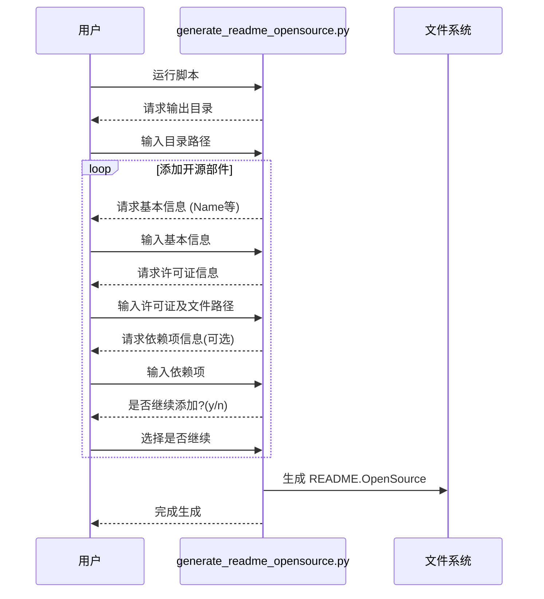

# 开源软件 `README.OpenSource` 工具使用文档

## 目录

- 开源软件 `README.OpenSource` 工具使用文档
  - 简介
  - 功能概述
  - 安装与环境配置
    - 环境要求
    - 安装步骤
  - 使用指南
    - 生成 `README.OpenSource` 文件
    - 验证 `README.OpenSource` 文件
      - 验证格式
      - 验证内容
    - 命令行参数
  - 目录结构
  - 工作流程概览
    - 生成工具流程图
    - 验证工具流程图

## 简介

本工具旨在为项目中的每个开源部件创建标准化的 `README.OpenSource` 文件，并提供验证这些文件格式和内容的功能。该工具仅使用 Python 标准库开发，易于安装和使用。通过合并生成和验证功能，用户可以使用单个脚本完成所有操作，并根据需要选择不同的功能场景。

## 功能概述

- 生成工具 ：
  - 通过交互方式，用户输入开源部件的信息，支持多个部件的输入。
  - 支持一对一、一对多、多对一的许可证和许可证文件关系配置。
  - 支持可选的依赖项配置，以逗号分隔多个依赖。
  - 生成符合规范的 `README.OpenSource` 文件，包含所有输入的部件信息。

- 验证工具：
  - **格式验证**：验证项目中所有 `README.OpenSource` 文件的格式，检查必需字段是否完整，JSON 格式是否正确。
  - **内容验证**：验证以下内容：
    - 对 `"Name"`、`"License"`、`"Version Number"`、`"Upstream URL"` 等字段与参考数据比对。
    - 验证 `"License File"` 字段指向的文件是否存在。
    - 验证 `"Dependencies"` 字段（若存在）是否为有效的字符串数组。

## 安装与环境配置

### 环境要求

- **Python 版本**：Python 3.6 或更高版本
- **操作系统**：跨平台，支持 Linux/Windows

### 安装步骤

1. **克隆或下载项目代码**

   ```
   git clone https://gitee.com/openharmony/developtools_integration_verification.git
   cd tools/opensource_tools
   ```

2. **（可选）创建虚拟环境**

   ```
   python -m venv venv
   source venv/bin/activate  # Linux/macOS
   # 或
   venv\Scripts\activate     # Windows
   ```

3. **安装依赖**

   由于该工具仅使用 Python 标准库，无需安装额外依赖。

## 使用指南

### 生成 `README.OpenSource` 文件

运行 `generate_readme_opensource.py` 脚本，按照提示输入开源部件的信息。

**步骤：**

1. **进入项目目录**

   ```
   cd src
   ```

2. **运行生成脚本**

   ```
   python generate_readme_opensource.py
   ```

3. **按照提示输入信息**
   - 输入输出目录（默认为当前目录）
   - 依次输入每个部件的详细信息：
     - Name：组件名称
     - Version Number：版本号
     - Owner：维护者
     - Upstream URL：上游地址
     - Description：描述信息
     - License：许可证（多个许可证用分号分隔）
     - License File：许可证文件路径（多个文件用分号分隔）
     - Dependencies（可选）：依赖项（多个依赖用逗号分隔）
   - 每个部件信息输入完成后，选择是否添加另一个部件

4. **完成生成**
   - 脚本将在指定的输出目录下生成JSON格式的 `README.OpenSource` 文件

### 验证 `README.OpenSource` 文件

#### 验证格式

验证项目中所有 `README.OpenSource` 文件的格式和必需字段。

**命令：**

```bash
python validate_readme_opensource.py --validate-format [目录路径]
```

验证检查内容：
- JSON格式的正确性
- 必需字段的完整性
- Dependencies字段（若存在）的数组格式

#### 验证内容

验证 `README.OpenSource` 文件内容与参考数据的一致性。

**命令：**

```bash
python validate_readme_opensource.py --validate-content --reference-data reference_data.json [目录路径]
```

验证内容包括：
- 核心字段（Name、License、Version Number、Upstream URL）与参考数据的一致性
- License File 文件实际存在性检查
- Dependencies字段（若存在）的有效性检查

### 命令行参数

验证工具支持以下命令行参数：

- `project_root`：必需，项目根目录路径
- `--validate-format`：执行格式验证
- `--validate-content`：执行内容验证
- `--reference-data`：参考数据JSON文件路径（内容验证必需）
- `--log-file`：日志文件路径，用于保存验证结果

## 目录结构

- **src/**
  - `generate_readme_opensource.py`：生成README.OpenSource开源部件配置信息脚本
  - `validate_readme_opensource.py`：验证工具脚本，包含JSON格式验证和内容验证功能
- **README_OSS.md**：使用文档（本文件）

## 工作流程概览

### 生成工具流程图



### 验证工具流程图

```mermaid
sequenceDiagram
    participant User as 用户
    participant Script as validate_readme_opensource.py
    participant FileSystem as 文件系统

    User->>Script: 运行验证命令
    Script->>FileSystem: 搜索 README.OpenSource 文件

    alt 格式验证
        Script->>Script: 检查JSON格式
        Script->>Script: 检查必需字段
        Script->>Script: 检查Dependencies格式
    end

    alt 内容验证
        Script->>Script: 加载参考数据
        Script->>Script: 比对字段内容
        Script->>FileSystem: 检查License文件
        Script->>Script: 验证Dependencies
    end

    alt 验证通过
        Script-->>User: 报告成功
    else 验证失败
        Script-->>User: 输出错误信息
    end